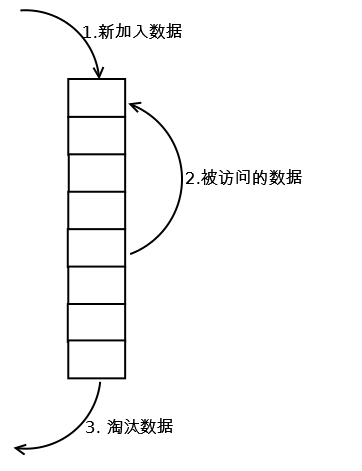
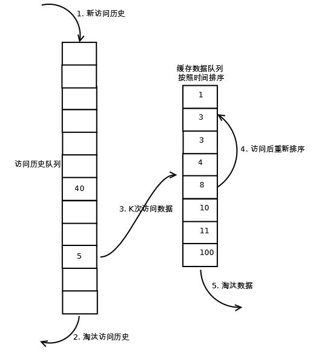

###### 20180308 阿里巴巴口碑网 技术一面（JAVA)  
1.自我介绍  
2.项目介绍  
3.关于项目的一些细节提问  

4.HashMap的原理  
HashMap实际上是一个“链表散列”的数据结构，即数组和链表的结合体。
存储 当我们往HashMap中put元素的时候，先根据key的hashCode重新计算hash值，根据hash值得到这个元素在数组中的位置如果数组该位置上已经存放有其他元素了，那么在这个位置上的元素将以链表的形式存放，新加入的放在链头，最先加入的放在链尾。如果数组该位置上没有元素，就直接将该元素放到此数组中的该位置上。  

5.HashMap的遍历方法
* 第一种 for each map.entrySet()
<pre>
Map<String,String> map = new HashMap<String,String>();
for(Entry<String,String> entry : map.entrySet()){
  entry.getKey();
  entry.getValue();
}
</pre>
* 第二种 调用Map.entrySet()的集合迭代器  
<pre>
Map<String,String> map = new HashMap<String,String>();
Iterator<Map.Entry<String,Stirng>> interator = map.entrySet().interator();
while(iterator.hasNext()){
  Map.Entry<String,String> entry = iterator.next();
  entry.getKey();
  entry.getValue();
}
</pre>

* 第三种 for each map.keySet(),再调用get获取  
<pre>
Map<String,String> map = new HashMap<String,String>();
for (String key : map.keySet()){
  map.get(key);
}
</pre>

6.HashMap在遍历中删除数据 用哪种遍历方法 怎么写？  
用While便利删除 如果用for的话 会丢失指针报错
<pre>
Map<String,String> map = new HashMap<String,String>();
Iterator<Map.Entry<String,Stirng>> interator = map.entrySet().interator();
while(iterator.hasNext()){
  Map.Entry<String,String> entry = iterator.next();
  iterator.remove();
}
</pre>

7.线程之间如何共享数据　　
* 使用Runable接口  
* 如果是多个线程执行相同任务的话 把公共的data放在Runable 把任务放在run()中  

```
public class MultiThreadShareData {

    public static void main(String[] args) {

        ShareData task = new ShareData(); //一个类实现了Runnable接口

        for(int i = 0; i < 4; i ++) {   //四个线程来卖票       
            new Thread(task).start();
        }

    }

}

class ShareData implements Runnable {

    private int data = 100;
    @Override
    public void run() { //卖票，每次一个线程进来，先判断票数是否大于0
            synchronized(this) {
                if(data > 0) {
                    System.out.println(Thread.currentThread().getName() + ": " + data);
                    data--;
                }
            }
    }
}
```

* 如果是多线程执行不同任务的话  做一个任务类 把任务放在类中 把公共的类放入 每个线程中执行Runable 执行类中的方法

```
public class MultiThreadShareData {

    public static void main(String[] args) {

        ShareData task = new ShareData(); //公共数据和任务放在task中

        for(int i = 0; i < 2; i ++) { //开启两个线程增加data

            new Thread(new Runnable() {

                @Override
                public void run() {
                    task.increment();
                }
            }).start();
        }

        for(int i = 0; i < 2; i ++) { //开启两个线程减少data

            new Thread(new Runnable() {

                @Override
                public void run() {
                    task.decrement();
                }
            }).start();
        }           
    }
}   


class ShareData{

    private int data = 0;
    public synchronized void increment() { //增加data
        System.out.println(Thread.currentThread().getName() + ": before : " + data);
        data++;
        System.out.println(Thread.currentThread().getName() + ": after : " + data);
    }

    public synchronized void decrement() { //减少data
        System.out.println(Thread.currentThread().getName() + ": before : " + data);
        data--;
        System.out.println(Thread.currentThread().getName() + ": after : " + data);
    }
}
```

8.LRU(Least Recently Used)最少使用数的算法
* 原理  
LRU算法是根据数据的历史访问记录来进行淘汰数据，其核心思想是"如果数据最近被访问过，那么将来被访问的机率也更高"
* 实现    
  * 最常见的实现方法是使用一个链表保存缓存数据  
     * 1.新数据插入到链表头部
     * 2.每当缓存被访问，则将数据移动到链表的头部
     * 3.当链表满的时候，将尾部数据淘汰


* LRU-K的实现
  * K代表最近的使用的次数 其核心思想是将“最近使用过1次”的判断标准扩展为“最近使用过K次”。  
  * 相比LRU，LRU-K需要多维护一个队列，用于记录所有缓存数据被访问的历史。只有当数据的访问次数达到K次的时候，才将数据放入缓存。当需要淘汰数据时，LRU-K会淘汰第K次访问时间距当前时间最大的数据。  
     * 1.数据第一被访问，加入到历史访问列表
     * 2.如果数据在访问列表后没有达到K次访问，则淘汰
     * 3.当历史访问队列的数据访问次数到达K次后，将数据索引从历史队列删除，将数据移到缓存队列中，并缓存此数据，缓存队列重新按照时间排序
     * 4.缓存数据队列中被再次访问后，重新排序；
     * 5.需要淘汰数据时，淘汰缓存队列中排在末尾的数据，即：淘汰“倒数第K次访问离现在最久”的数据。


9.gc(垃圾回收）流程  

如果是年轻代的内存的话 年轻带里的Eden区满了的时候，就是执行Minor GC 将消亡的对象清理掉，将剩余的对象复制到一个存活区Survivor0（此时，Survivor1是空白的，两个Survivor总有一个是空白的）
此后，每次Eden区满了，就执行一次Minor GC，并将剩余的对象都添加到Survivor0；
当Survivor0也满的时候，将其中仍然活着的对象直接复制到Survivor1，以后Eden区执行Minor GC后，就将剩余的对象添加Survivor1（此时，Survivor0是空白的）。
当两个存活区切换了几次（HotSpot虚拟机默认15次，用-XX:MaxTenuringThreshold控制，大于该值进入老年代）之后，仍然存活的对象（其实只有一小部分，比如，我们自己定义的对象），将被复制到老年代。

年老代中 当年老代内存不足时 会执行 Full GC。　　

方法区（永久代）当常量没有引用了就回收
